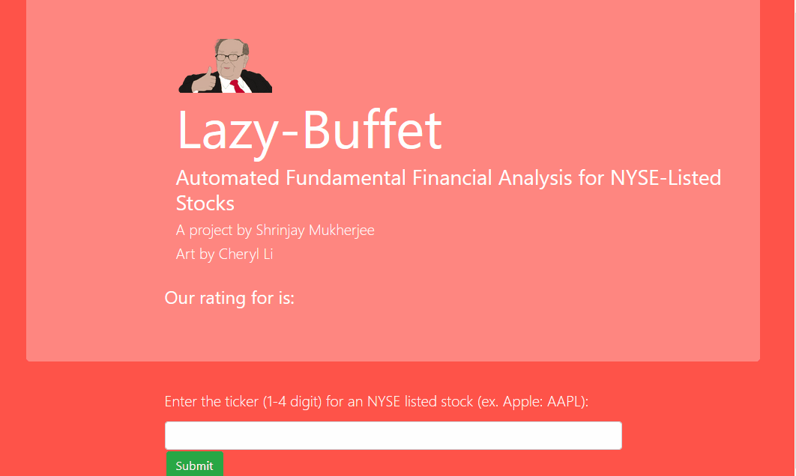

## Lazy-Buffet

Ever wish you could have Warren Buffet by your side, giving you his take on whatever stock you can think of (as long as it's NYSE-listed)? No? Just me? Anyways, I built this simple project to do just that. 

Simply enter the ticker of an NYSE-listed stock, like AAPL or TSLA (to the moon btw), and you'll get a fundamental analysis that works much like a very lazy Buffet, considering price-to-earnings, price-to-earnings growth, price-to-book-value, profit margin, current ratio and debt ratio to give you a fundamental analysis of your selected stock! 

**This is not a roboadvisor, it is not designed to give sound financial advice, it is designed to satisfy my fascination with fundamental analysis. I am not responsible for any losses on your TSLA puts**

## Demo

**An example of lazy-buffet in action. Unfortunately for one of us, he thinks that TSLA is not a good buy. Only time will tell on that one.**

## Deployment

Download, get an API key for AlphaVantage, set the API key in a .env file, and off you go! You can also use the live version hosted on heroku at the link in the description. 